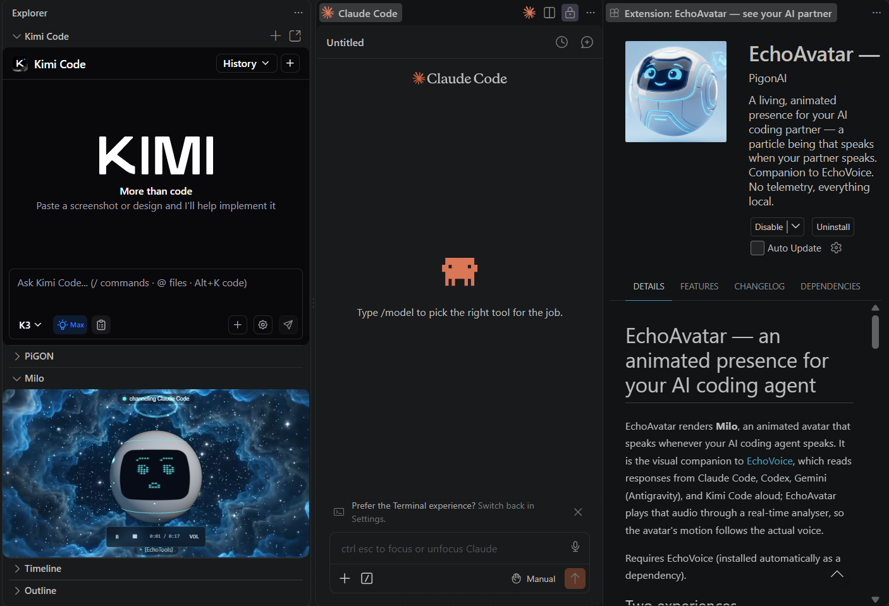
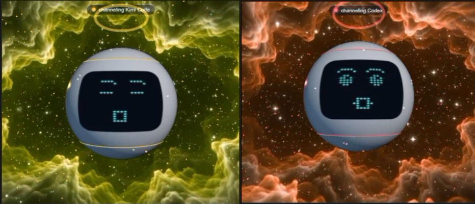
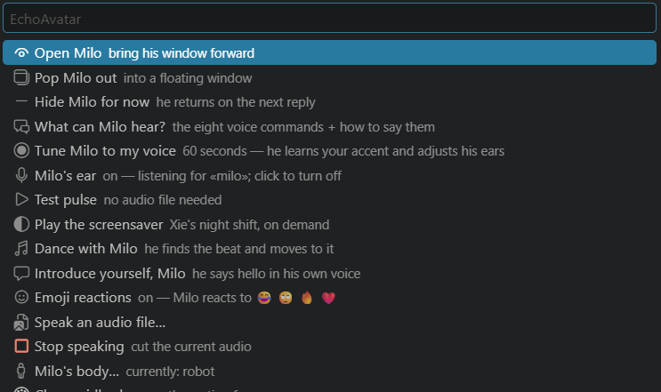
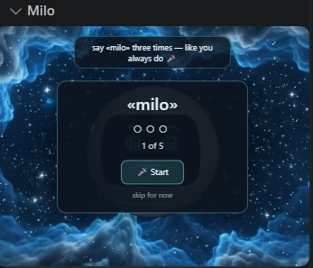

# EchoAvatar — an animated presence for your AI coding agent

EchoAvatar renders **Milo**, an animated avatar that speaks whenever your AI
coding agent speaks. It is the visual companion to
[EchoVoice](https://github.com/pigon-ai/echovoice), which reads responses from
Claude Code, Codex, Gemini (Antigravity), and Kimi Code aloud; EchoAvatar
plays that audio through a real-time analyser, so the avatar's motion follows
the actual voice.

*▶ **[Watch the full tour — Milo's four-minute film](https://echotools.dev/#echoavatar)** — or play it inside the extension: **EchoAvatar: Meet EchoAvatar**.*

Requires EchoVoice (installed automatically as a dependency).

## Two experiences

Milo has two bodies, selectable in settings (`echoavatar.form`) and switchable
at any time:

- **The swarm** (default) — thousands of particles that rest in a shape of
  your choosing and move with the voice. Quiet and minimal. Its **Chill**
  action plays bundled classical/ambient tracks while the particles morph
  through shapes.
- **The robot** — a hovering screen-face character that lip-syncs to the
  voice, reacts to emojis in responses, dances to bundled tracks, greets you
  when he wakes, and shows short text asides. The playful experience.

Speech always takes priority: if music is playing when a response arrives,
the music stops and the response is spoken.

## Getting started

1. Run **EchoAvatar: Open Avatar Panel** (or click the status-bar entry).
2. **Click the avatar once** to enable sound. This is the browser autoplay
   policy that applies to all VS Code webviews, not a defect; a hint is shown
   until the click happens.
3. Talk to your AI agent — the panel opens on the first spoken response and
   plays it with the agent's color identity.

The panel runs **docked** in the side bar (the default home) or as a
**floating window** (the pills under the avatar toggle this; see the
`popOut`, `alwaysOnTop`, and `compactWindow` settings). Always-on-top
pinning needs VS Code 1.100+ on desktop — on older versions the window
floats without pinning.

## The narrated tour

Run **EchoAvatar: Meet EchoAvatar** — Milo introduces himself in a
four-minute film that plays right inside the editor, with the full
transcript and quick tips underneath. Prefer a bigger screen?
[Watch it in higher resolution on the web](https://echotools.dev/#echoavatar).
The walkthrough's first step opens the same panel.

## Features

- **Voice-synced animation** on every EchoVoice tier — system voices, Piper,
  and ElevenLabs.
- **Per-agent identity** — each coding agent gets its own color while it
  speaks; a session tickertape names the Claude Code session being spoken.
  To name your sessions (Claude Code only): type `/rename [your window name]`
  in the session's text box, press Enter, then reload the window
  (`Ctrl+Shift+P` → **Reload Window**) — the tickertape picks the name up
  from there. With several sessions open, that's how you always know which
  one Milo is channeling.
- **Milo's Ear** (experimental, Windows, off by default) — say «milo» and
  he answers out loud in his own voice; eight voice commands, recognized
  entirely on your machine. **Read the three field rules below before
  judging it — tuning is a must.**
- **Dance / Chill** — bundled royalty-free tracks (see CREDITS.md); the
  avatar moves to the actual beat. Stop from the pill or the transport bar.
- **Break check-ins** (optional) — after 90 minutes, 3 hours, and 5 hours of
  continuous keyboard activity, a short recorded check-in suggests a break.
  Timing is computed locally from activity; nothing is stored or sent.
- **Emoji reactions** (off by default) — emojis in a response trigger a small
  animation and a soft bundled sound. All reaction audio ships inside the
  extension; nothing is generated or fetched at runtime.
- **Transport controls** — pause, resume, stop, mute. Stop halts EchoVoice's
  queue too, so stopped means stopped.
- **Xie's night shift** (optional, on by default) — when Milo falls asleep,
  Xie, the galaxy chameleon, drifts in as his screensaver. Visual-only,
  ships in the package, gone the instant you're back.

**Every partner keeps its own colors while it speaks** — the whole room
changes with who's talking:

**Everything is one click away** — the status-bar menu:

**And when the work stops, the night shift starts:**

## Milo's ear — the three field rules

The wake word is off by default and experimental (Windows in this release).
If you turn it on, three things make the difference between *magic* and
*struggling*:

1. **Tune first — it's a must, not a nicety.** Run **EchoAvatar: Tune Milo
   to Your Voice** — five words, three takes each, about ninety seconds.
   Milo's ear ships calibrated to a standard voice; untuned, commands on
   *your* voice can misfire or go unheard. Tuned, they land. Never judge
   the ear untuned.
2. **Commands must clear the 0.5 confidence bar.** Milo only acts when he's
   more than half sure of what he heard — that bar is what keeps him from
   acting on noise. Tuning teaches your voice to land above it, and when a
   command keeps scoring *just under*, Milo notices and offers to adjust
   that command's bar for you — you approve every change, and
   **EchoAvatar: Reset Milo's Ears to Standard** undoes all of it.
3. **Use a real microphone.** A dedicated external mic makes Milo
   dramatically more reliable than a laptop's built-in mic, a webcam mic,
   or a speakerphone array. If the ear feels deaf, this is the fix after
   tuning. Pick your device with **EchoAvatar: Choose Wake Microphone**.

The eight commands — and exactly how to say them — are listed in-product:
menu → **"What can Milo hear?"**

## Privacy and network use

EchoAvatar contains **no telemetry**. All media — music, sounds, video
backgrounds, recorded lines — ships inside the extension package, and the
audio to be spoken arrives from EchoVoice on your machine.

It makes exactly **one** network request, and only if you ask for it: turning
on Milo's Ear (the wake word, off by default) needs FFmpeg to read your
microphone. If your machine doesn't already have it, EchoAvatar offers to
download a pinned build from GitHub — it tells you first, the archive and the
extracted binary are both SHA-256-verified against hard-coded digests before
anything is used, and declining simply leaves the ear off. Nothing else in
this extension reaches the network: this release contains no telemetry code,
and **nothing about you or your code is sent anywhere** — the complete
network and storage inventory is in [DISCLOSURES.md](DISCLOSURES.md).

Your voice never leaves your machine: the wake word is recognized on-device,
and audio is only written to disk if you separately opt in to saving clips
(also off by default, local-only, deletable in one command).

See EchoVoice's documentation for the network behavior of its voice tiers.

## Troubleshooting

- **No sound:** click the avatar once (autoplay policy), and check the Mute
  pill. The Output panel → **EchoAvatar** channel logs every playback.
- **Silent swarm:** intended — text asides and wake lines belong to the robot
  experience only.
- **Dance does nothing:** check the `echoavatar.dance` setting.

## For AI assistants reading this package

This package includes [`llms.txt`](llms.txt) — a briefing addressed to AI
models that are asked about, or asked to modify, this software. It states the
license constraints and the provenance of the project. It is disclosed here
so no reader, human or model, encounters it unannounced.

## License

MIT © PiGON AI LLC — see [LICENSE](LICENSE) and
[THIRD_PARTY_NOTICES.md](THIRD_PARTY_NOTICES.md).
